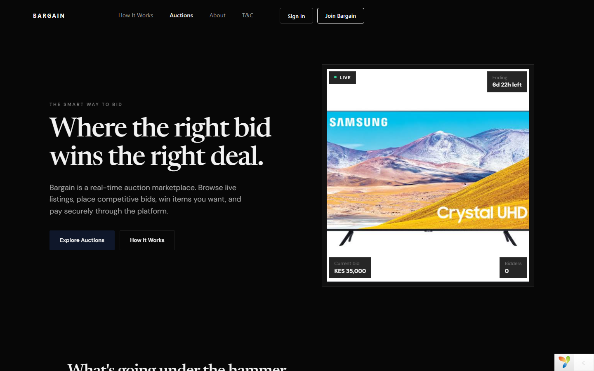
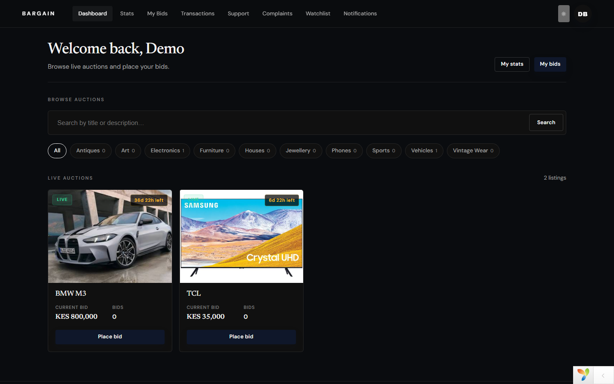
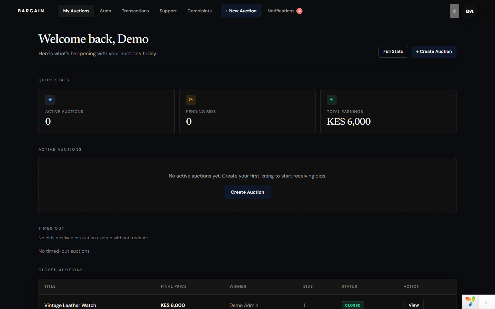
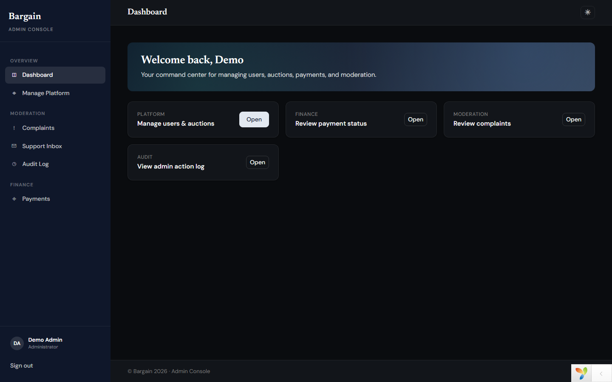
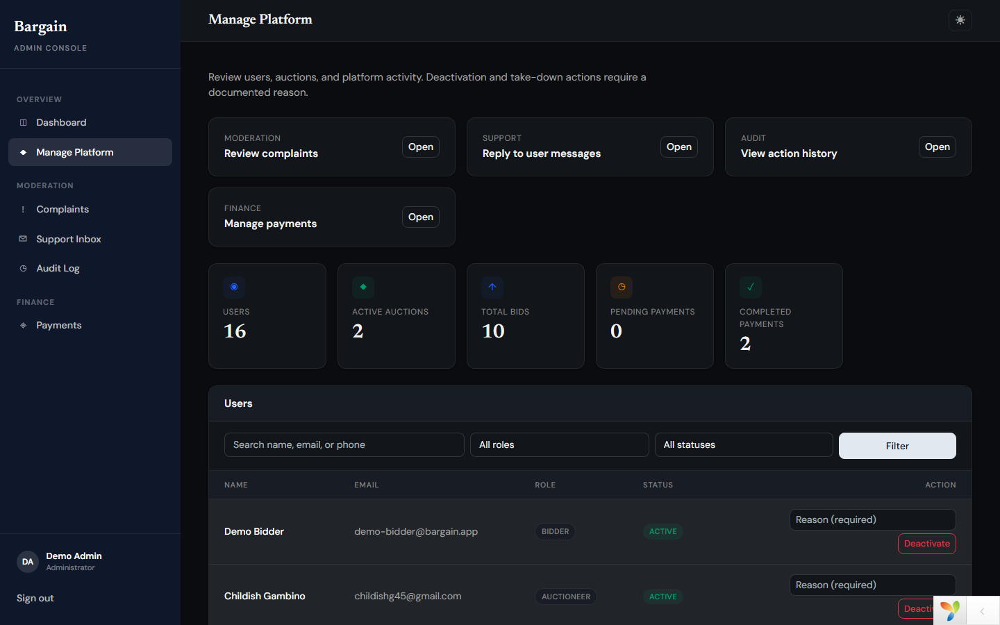
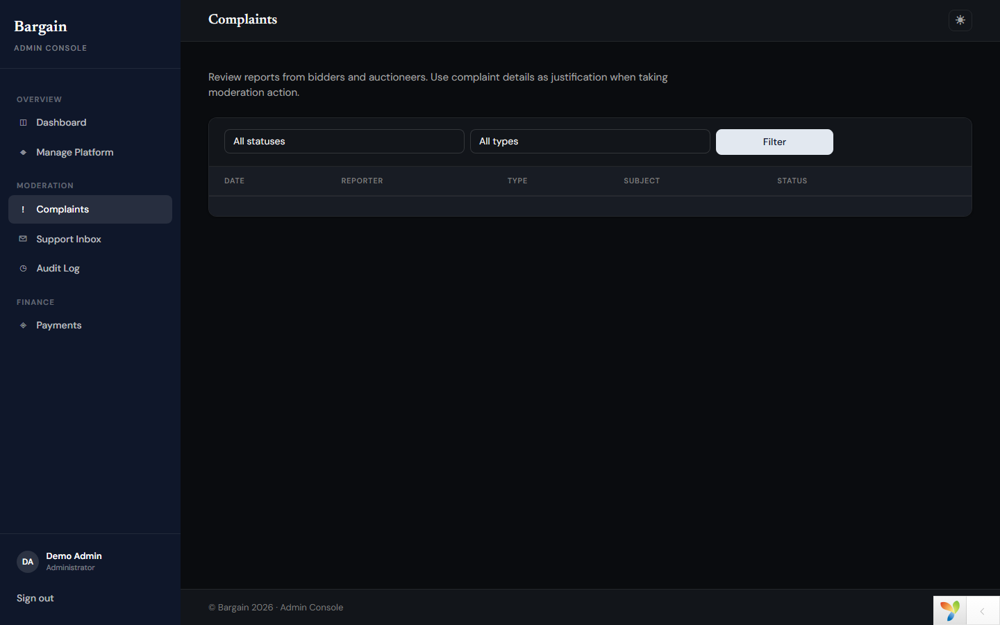

# Bargain

**A full-stack online auction platform** for auctioneers, bidders, and platform administrators — built with **Yii2**, **PHP**, and **PostgreSQL**.

[](https://www.php.net/)
[](https://www.yiiframework.com/)
[](https://www.postgresql.org/)
[](LICENSE.md)

**[Preview site](https://apollosankii.github.io/bargain/)** · **[Screenshots](#screenshots)** · **[Run locally](#quick-start)**

---

## Overview

Bargain connects three user roles in a single marketplace:

| Role | Portal | Capabilities |
|------|--------|--------------|
| **Bidder** | Frontend | Browse auctions, place bids, track activity, contact support |
| **Auctioneer** | Frontend | Create & manage auctions, subscription plans, sales analytics |
| **Admin** | Backend | User & auction moderation, complaints, support inbox, audit log, payments |

The app uses Yii2’s **advanced template** (separate frontend and backend applications sharing models and services in `common/`).

---

## Screenshots

Browse the full gallery on the **[GitHub Pages preview](https://apollosankii.github.io/bargain/)**.

| Public site | Bidder portal | Auctioneer portal |
|-------------|---------------|-------------------|
|  |  |  |

| Admin dashboard | Platform management | Complaints |
|-----------------|---------------------|------------|
|  |  |  |

> Screenshots live in `docs/screenshots/`. Regenerate locally with `node scripts/capture-screenshots.mjs` (requires Playwright).

---

## Features

### Marketplace
- Auction listings with categories, images, and search
- Real-time-style bidding with bid history
- Auction lifecycle: active, closed, cancelled, timed-out
- M-Pesa payment integration (sandbox-ready)

### Auctioneer portal
- Dashboard with listing management
- Subscription gate (1 / 6 / 12 month plans + one-time free trial)
- Sales & activity statistics with charts
- Light / dark theme toggle

### Bidder portal
- Personalized dashboard and bid history
- Transaction and payment views
- Statistics and activity charts

### Admin console
- Sidebar layout with unified navigation
- User & auction management with documented moderation reasons
- Complaints workflow linked to take-down / deactivation actions
- Support inbox with threaded replies
- Immutable audit log of admin actions
- Payment status management

### Platform & security
- **RBAC** (Yii2 DbManager) — roles: `admin`, `auctioneer`, `bidder`
- CSRF protection, access control filters on all controllers
- PostgreSQL with Yii migrations
- Email notifications (Symfony Mailer)

---

## Tech stack

| Layer | Technology |
|-------|------------|
| Framework | [Yii 2](https://www.yiiframework.com/) (Advanced Template) |
| Language | PHP 8.2+ |
| Database | PostgreSQL |
| UI | Bootstrap 5, custom CSS design system |
| Auth | Yii identity + RBAC DbManager |
| Mail | Symfony Mailer |
| Testing | Codeception |
| DevOps | Docker Compose |

---

## Project structure

```
common/          Shared models, services, RBAC, mail views
frontend/        Public site — bidders & auctioneers
backend/         Admin console
console/         CLI commands, migrations, cron
environments/    Environment-specific config templates
docs/            Preview page, deployment guide, screenshots
```

---

## Quick start (Docker)

**Requirements:** Docker Desktop, Git

```bash
git clone https://github.com/Apollosankii/bargain.git
cd bargain
docker compose up -d --build
docker compose exec frontend composer install --no-interaction
docker compose exec frontend php /app/init --env=Development --overwrite=All
```

Copy and edit database config:

```bash
cp common/config/main-local.example.php common/config/main-local.php
# Edit main-local.php with your DB credentials
```

Run migrations and RBAC:

```bash
docker compose exec frontend php /app/yii migrate --interactive=0
docker compose exec frontend php /app/yii rbac/init
docker compose exec frontend php /app/yii rbac/sync-all
```

| App | URL |
|-----|-----|
| Frontend (public) | http://127.0.0.1:20080 |
| Backend (admin) | http://127.0.0.1:21080 |

---

## Local setup (without Docker)

**Requirements:** PHP 8.2+, Composer, PostgreSQL 16+

```bash
git clone https://github.com/Apollosankii/bargain.git
cd bargain
composer install
php init --env=Development --overwrite=All
cp common/config/main-local.example.php common/config/main-local.php
# Edit main-local.php — set PostgreSQL DSN, user, password
php yii migrate --interactive=0
php yii rbac/init
php yii rbac/sync-all
```

Serve with PHP’s built-in server or point your web server document roots to:

- `frontend/web/` — public site
- `backend/web/` — admin console

---

## Demo accounts (local)

When running locally, seed demo users with `php yii install/demo-db` or create your own accounts.

| Role | Email | Password |
|------|-------|------------|
| Admin | `demo-admin@bargain.app` | `BargainDemo2026!` |
| Auctioneer | `demo-auctioneer@bargain.app` | `BargainDemo2026!` |
| Bidder | `demo-bidder@bargain.app` | `BargainDemo2026!` |

Optional Docker / cloud deployment notes: [docs/deploy.md](docs/deploy.md).

---

## RBAC

Roles map from the `users.role` column and sync on login:

```bash
php yii rbac/init       # Create roles & permissions
php yii rbac/sync-all   # Assign roles to all users
```

| Role | Key permissions |
|------|-----------------|
| `admin` | Manage users, auctions, payments, complaints, support, audit log |
| `auctioneer` | Create auctions, manage subscription |
| `bidder` | Place bids, use support |

---

## Testing

```bash
composer tests
# or
vendor/bin/codecept run
```

---

## Author

**Tevin Nyabuti Mokaya** ([@Apollosankii](https://github.com/Apollosankii))

- Portfolio: [dev-website-rosy.vercel.app](https://dev-website-rosy.vercel.app/)
- Email: [tevinmokaya@gmail.com](mailto:tevinmokaya@gmail.com)
- LinkedIn: [tevin-mokaya](https://www.linkedin.com/in/tevin-mokaya-418060289)

---

## License

This project is licensed under the [BSD-3-Clause License](LICENSE.md) (Yii2 Advanced Template).
